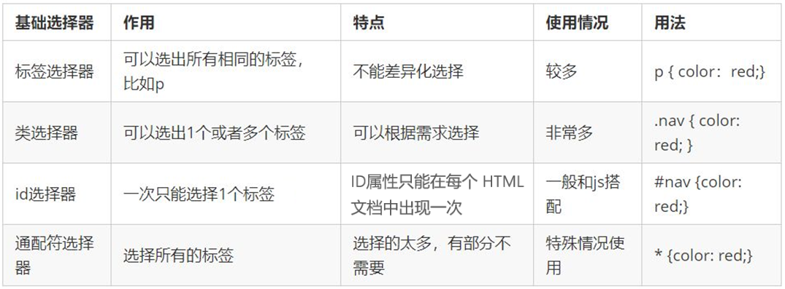
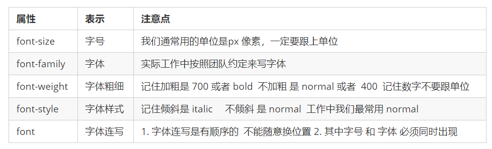

# CSS基础


## 使用CSS

### 行内样式

直接写在标签上


### 内部样式

`<style>` 标签理论上可以放在 HTML 文档的任何地方，但一般会放在文档的`<head>`标签中


### 外部样式

在`<head>`中引入外部css

```css
<head>
	<link ref="stylesheet" href="css-name.css">
</head>
```


## 基础选择器




### 标签选择器

也称为元素选择器


### 类选择器

使用`. + class名称`表示

- 单类名

- 多类名。

  ```css
  <div class="class-name1 class-name2"> </div>
  ...
  .class-name1, .class-nam2 {
  
  }
  ```

  


### id选择器

使用`# + id名称`表示


### 通配符选择器

使用`*`表示

```html
* {
	...
}
```


## 复合选择器

### 后代选择器 

格式`父标签 子标签 { ... }`


### 子选择器 

（只对第一个子元素有效）

格式`父标签 > 子标签`


### 并集选择器

格式 `标签1, 标签2, ...`


### 伪类选择器

伪类选择器用于向某些选择器添加特殊的效果，比如给链接添加特殊效果，或选择第1个，第n个元素。

格式 `:标签`

#### a伪类选择器

- `a:link`	没有点击过的(访问过的)链接
- `a:visited`	点击过的(访问过的)链接
- `a:hover`	鼠标经过的那个链接
- `a:active`	鼠标正在按下还没有弹起鼠标的那个链接

为了确保生效，请按照 LVHA 的循顺序声明 :link－:visited－:hover－:active。

#### input伪类选择器

- `input:focus` 用于选取获得焦点的表单元素


## 字体



- font-family
- font-size
- font-weight 设置文本粗细。建议使用数字，范围100-900
  - lighter - 100
  - normal - 400
  - bold - 700
  - bolder - 900
- font-style
  - normal
  - italic

写成一行，格式为（严格要求顺序，并且必须保留 font-size 和 font-family 属性）

```css
font: font-style font-weight font-size/line-height font-family
```


## 文本

- color
  - 预定颜色如 `red black green ...`

  - 十六进制 `#FF00FF`

  - RGB代码 `rgb(255,0,255)` 或 `rgb(100%,0,100%)`

- text-align 文本水平对齐 `left center right`
- text-decoration
  - none （默认）
  - underline 下划线
  - overline 上划线
  - line-through 删除线
- text-indent 缩进，单位em，表示字符个数
- line-height 行高（即行之间的距离）


## 显示模式

### 分类

#### 块元素

