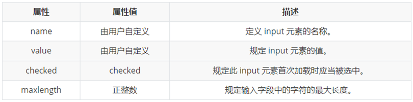

# HTML基础


## VS code快速创建html文本

- 输入`! + enter`就可以创建html


## 常用标签

- `<h1>到<h6>` 标题

- `<p>` 段落标签

- `<br>` 换行

- `<hr>` 一行直线

- 文本

  - `<strong>`（推荐）或`<b>` 加粗
  - `<em>`（推荐）或`<i>` 倾斜
  - `<del>`（推荐）`<s>` 删除线
  - `<ins>`（推荐） `<u>` 下划线

- 块

  - `<div>` （大）盒子
  - `<span>` （小）盒子

  


## 图像img

- src 
- alt 图像加载失败时，用于替代显示的文字
- title 鼠标放在图像上显示的文字
- width
- height
- border


### 超链接a

- herf 目标地址。用#表示空链接
- targer 打开链接方式。方式
  - _self 在当前标签页打开(默认)
  - _blank 在新标签页打开

锚点标签

```html
<!-- 跳转到锚点位置-->
<a href="#name">...</a>
<!--定义锚点-->
<... id="name"> ...</...>
```


## 特殊字符

- `<`  &nbsp
- `<` &gt
- `>` &lt


## 表格table

- `<thead>` 头部区域
- `<tbody>` 主体区域

- `<th>` 表头table head
- `<tr>` 表行table row
- `<td>` 表数据table data

- align 对齐 left center right
- border 边框 "0"-无边框（默认） "1"-边框为1
- cellpadding 单元格与边框之间的距离
- cellspacing  单元格之间的距离


#### 合并单元格

- rowspan
- colspan


## 列表

### 无序列表ul

- li 具体内容


### 有序列表ol

- li 具体内容


### 描述列表dl

- dt 描述表格
- dd 描述内容


## 表单form

#### 输入表单input

- type属性

  

  


**lable与input结合使用**，用于绑定一个表单元素

```html
<!-- <label> 标签的 for 属性应当与相关元素的 id 属性相同。-->
<label for="sex">男</label>
<input type="radio" name="radioInput" id="sex"><input>
...
```


#### 下拉表单select

- option 可选内容
  - selected 选中


#### 文本表单textarea

- cols 每行允许显示的字符
- rows 显示的行数


