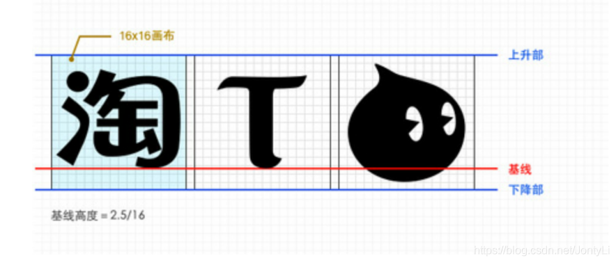

# css样式笔记总结


# 1\. CSS简介

## 你需要具备的知识

在继续学习之前，你需要对下面的知识有基本的了解：  HTML / XHTML

## 什么是CSS?

CSS 指层叠[样式表](https://so.csdn.net/so/search?q=%E6%A0%B7%E5%BC%8F%E8%A1%A8&spm=1001.2101.3001.7020) (Cascading Style Sheets)  

- 样式定义了如何显示控制 HTML 元素，从而实现美化HTML网页。  
- 样式通常存储在样式表中，目的也是为了解决内容与表现分离的问题  
- 外部样式表(CSS文件)可以极大提高工作效率  
- 多个样式定义可层叠为一，后者可以覆盖前者样式

## 样式层叠次序

当同一个 HTML 元素定义了多个样式时，应该使用哪个样式？  

一般而言，所有的样式会根据下面的规则层叠于一个新的虚拟样式表中，其中数字 4 拥有最高的优先权。

1. 浏览器缺省设置
2. 外部样式表
3. 内部样式表（位于 标签内部）
4. 内联样式（在 HTML 元素内部）  

因此，内联样式（在 HTML 元素内部）拥有最高的优先权，这意味着它将优先于以下的样式声明： åå标签中的样式声明，外部样式表中的样式声明，或者浏览器器中的样式声明（缺省值）。

# 2\. CSS基础语法

## CSS的语法：

案例例如下：其中[选择器](https://so.csdn.net/so/search?q=%E9%80%89%E6%8B%A9%E5%99%A8&spm=1001.2101.3001.7020)器也叫选择符

## CSS中的注释：

格式： 选择器{属性:值; 属性:值; 属性:值; …}

```css
p{
  color:red;
  text-align:center;
}
格式： /* ... */
```

# 3\. CSS使用方式

## 如何插入样式表

CSS是负责美化网页的，在HTML中如何使用css样式(HTML中引入CSS的方式):  

插入样式表的方法有三种:

- 外部样式表(External style sheet)
- 内部样式表(Internal style sheet)
- 内联样式(Inline style)  

(1). 内联方式（内样式）

- 就是在HTML的标签中使用style属性来设置css样式

格式： `<html标签 style="属性:值;属性:值;....">被修饰的内容</html标签>`  

(2). 内部方式（内嵌样式）  
就是在head标签中使用`<style type="text/css"> .... </style>` 标签来设置css样式

```css
<style type="text/css">
  ....css样式代码
</style>
<!-- 特点：作用于当前整个页面 -->
```

(3). 外部导入方式（外部链入）

- 3.1(推荐）就是在head标签中使用标签导入一个css文件，在作用于本页面，实现css样式设置

```css
 <link href="文件名.css" type="text/css" rel="stylesheet"/>
```

- 3.2 还可以使用import在style标签中导入入css文件。

```css
 <style type="text/css">
  @import "style.css";
</style>
```

- 特点：作用于整个网站
- 优先级：当样式冲突时，就是采用就近原则，是值css属性离被修饰的内容最近的为主。
- 若没有样式冲突则采用叠加效果。

## 三种样式表总结：


# 4\. CSS中常用选择器器

## 4.1 css2的选择符(重要)

### (1). html选择符（标签选择器器）

```css
就是把html标签作为选择符使用
如 p{....}  网页中所有p标签采用此样式
h2{....}  网页中所有h2标签采用此样式
```

### (2). class类选择符 (使用点.将自定义名（类名）来定义的选择符)

```css
定义：  .类名{样式....}    匿匿名类
其他选择符名.类名{样式....}
使用：<html标签 class="类名">...</html标签>    
.mc{color:blue;} /* 凡是class属性值为mc的都采用此样式 */
p.ps{color:green;}  /*只有p标签中class属性值为ps的才采用此样式*/
注意：类选择符可以在网页中重复使用
```

### (3). Id选择符

```css
定义： #id名{样式.....}
使用：<html标签 id="id名">...</html标签>
注意：id选择符只在网页中使用一次.
```

**选择符的优先级：从大到小 \[ID选择符\]->\[class选择符\]->\[html选择符\]->\[html属性\]**

### (4). 关联选择符（包含选择符）

**格式： 选择符1 选择符2 选择符3 …{样式…}**

```css
table a{....} /*table标签里里里的a标签才采用此样式*/
h1 p{color:red} /*只有h1标签中的p标签才采用此样式*/
```

### (5). 组合选择符（选择符组）

**格式： 选择符1,选择符2,选择符3 …{样式…}**

```css
h3,h4,h5{color:green;} /*h3、h4和h5都采用此样式*/
```

### (6). 伪类选([伪元素](https://so.csdn.net/so/search?q=%E4%BC%AA%E5%85%83%E7%B4%A0&spm=1001.2101.3001.7020))择符

**格式： 标签名:伪类名{样式…}**

```css
a:link {color: #FF0000; text-decoration: none}        /* 未访问的链接 */
a:visited {color: #00FF00; text-decoration: none}     /* 已访问的链接 */
a:hover {color: #FF00FF; text-decoration: underline}  /* 鼠标在链接上 */
a:active {color: #0000FF; text-decoration: underline}   /* 激活链接 */
```

## 4.2 [CSS3](https://so.csdn.net/so/search?q=CSS3&spm=1001.2101.3001.7020)中的选择器器（熟悉）

### (1). 关系选择器

```css
div>p 选择所有作为div元素的子元素p
div+p 选择紧贴在div元素之后p元素
div~p 选择div元素后面的所有兄弟元素p
```

### (2). 属性选择器

```css
[attribute]选择具有attribute属性的元素。
[attribute=value]选择具有attribute属性且属性值等于value的元素。
[attribute~=value]选择具有attribute属性且属性值为一用空格分隔的字词列表，其中一个等于
value的元素。 
[attribute|=value]选择具有att属性且属性值为以val开头并用连接符"-"分隔的字符串的E元素。
[attibute^=value]匹配具有attribute属性、且值以valule开头的E元素
[attribute$=value]匹配具有attribute属性、且值以value结尾的E元素
[attribute*=value]匹配具有attribute属性、且值中含有value的E元素
```

### (3). 结构性伪类选择器

```css
::first-letter设置对象内的第一个字符的样式。 
::first-line设置对象内的第一行的样式。 
:before设置在对象前（依据对象树的逻辑结构）发生的内容。
:after设置在对象后（依据对象树的逻辑结构）发生的内容。
:lang(language)匹配使用特殊语言的E元素。 
:element1~element2:
:first-of-type匹配同类型中的第一个同级兄弟元素
:last-of-type匹配同类型中的最后一个同级兄弟元素
:only-of-type匹配同类型中的唯一的一个同级兄弟元素
:only-child匹配父元素仅有的一个子元素
*:nth-child(n)匹配父元素的第n个子元素
:nth-last-child(n)匹配同类型中的倒数第n个同级兄弟元素
*:first-child 匹配父元素的第一个子元素
 * :last-child 匹配父元素的最后一个子元素
:root匹配元素在文档的根元素。在HTML中，根元素永远是HTML 
:empty匹配没有任何子元素（包括text节点）的元素
```

### (4). \*状态伪类选择器

```css
:link 设置超链接a在未被访问前的样式。
:visited 设置超链接a在其链接地址已被访问过时的样式
:active  设置元素在被用户激活（在鼠标点击与释放之间发生的事件）时的样式
*:hover 设置元素在其鼠标悬停时的样式
*:focus 设置元素在其获取焦点时的样式
:target 匹配相关URL指向的E元素
:enabled   匹配用户界面上处于可用状态的元素
:disabled   匹配用户界面上处于禁用状态的元素
:checked   匹配用户界面上处于选中状态的元素
:not(selector)匹配不不含有selector选择符的元素
::selection  设置对象被选择时的样式
```

### (5). 其他伪类选择器

```css
E:not(s) ： {attribute}
匹配所有不不匹配简单选择符s的元素E
p:not(.bg) {background-color:#00FF00;}
```

# 5\. CSS常用属性

## 5.1 尺寸寸与单位

- ① 尺寸  
    
    
- ② 颜色  
    
    
- ③ color颜色色属性值
  

```css
a. HSL颜色色:  通过对色色调(H)、饱和度(S)、亮度(L)三个颜色色通道的变化以及它们相互之间的叠加来得
到各式各样的颜色色.
 background-color: hsl(240,100%,50%);color:white；
b. HSLA颜色色: 色色调(H)、饱和度(S)、亮度(L)、透明度(A)；
 background-color: hsla(0,100%,50%,0.2);
*c. RGB颜色色: 红(R)、绿(G)、蓝(B)三个颜色色通道的变化
 background-color: rgba(200,100,0);
d. RGBA颜色色: 红(R)、绿(G)、蓝(B)、透明度(A)
 background-color: rgba(0,0,0,0.5);
*e. 图片透明度的设置  img.opacity{ opacity:0.25;}
      兼容IE8 filter:alpha(opacity=100);
```

## 5.2 字体属性：font

```css
font: 简写
*font-size:     字体大小：20px，60%基于父对象的百分比取值
*font-family： 字体：宋体，Arial
 font-style：  normal正常；italic斜体； oblique倾斜的字体 
*font-weight： 字体加粗 ：bold
 font-variant:  small-caps 小型的大写字母字体
 font-stretch:  [了解]字的拉伸是相对于浏览器显示的字体的正常宽度（部分浏览器不支持）。  
```

- 可以通过js中escape()编码函数来测试属于什么字体。  
    
- 为了照顾不同电脑的字体安装问题，我们尽量只使用宋体和微软雅黑中文字体

## 5.3 文本属性

```css
text-indent: 首缩进：text-indent:2em;
 text-overflow： 本的溢出是否使用省略标记（...）。clip|ellipsis（显示省略标记）
*text-align:  文本的位置：left center right
 text-transform：对象中的文本的大小写：capitalize(首字母)|uppercase写|lowercase写
*text-decoration: 字体画线：none无、underline下画线，line-through贯穿线
 text-decoration-line：[了解]文本装饰线条的位置（浏览器不不兼容）
*text-shadow: 文本的文字是否有阴影及模糊效果
 vertical-align: 本的垂直对齐方式
 direction：文字流方向。ltr | rtl
 white-space:nowrap; /* 强制在同一内显示所有文本*/
*letter-spacing: 文字或字母的间距
 word-spacing：单词间距
*line-height：行高
*color： 字体颜色
```


## 5.4 背景属性：background

```css
background：简写
*background-color: 背景颜色色
*background-image: 背景图片
*background-repeat：是否重复，如何重复?(平铺)
*background-position：定位
 background-attachment： 是否固定背景，
        scroll:默认值。背景图像是随对象内容滚动
        fixed:背景图像固定                
css3的属性:                
*background-size: 背景大小，如 background-size:100px 140px;
多层背景：
 background:url(test1.jpg) no-repeat scroll 10px 20px,
      url(test2.jpg) no-repeat scroll 50px 60px,
      url(test3.jpg) no-repeat scroll 90px 100px;
 background-origin:content-box,content-box,content-box;
 background-clip:padding-box,padding-box,padding-box;
 background-size:50px 60px,50px 60px,50px 60px;
```

## 5.5 \* 边框

**盒子模型：**  
  


```css
border:宽度 样式 颜色色;
border-color;
border-style; 边框样式：solid实现，dotted点状线，dashed虚线
border-width:
border-left-color;
border-left-style;
border-left-width:
...
CSS3的样式
border-radius：圆⻆角处理理
box-shadow: 设置或检索对象阴影
```

## 5.6 \* 内补白（内补丁）

```css
padding：    检索或设置对象四边的内部边距,如padding:10px; padding:5px 10px;
padding-top：  检索或设置对象顶边的内部边距
padding-right：  检索或设置对象右边的内部边距
padding-bottom：检索或设置对象下边的内部边距
padding-left： 检索或设置对象左边的内部边距
```

## 5.7 \* 外补白（外补丁）

```css
margin：   检索或设置对象四边的外延边距,如 margin:10px;  margin:5px auto;
margin-top： 检索或设置对象顶边的外延边距
margin-right： 检索或设置对象右边的外延边距
margin-bottom： 检索或设置对象下边的外延边距
margin-left：  检索或设置对象左边的外延边距 
```

## 5.8 Position定位

```css
*position:  定位方式：absolute(绝对定位)、fixed(固定)（relative定位参考，可对内部相对
absolute定位）
*z-index: 层叠顺序，值越大越在上方。
*top:   检索或设置对象与其最近一个定位的父对象顶部相关的位置
 right:   检索或设置对象与其最近一个定位的父对象右边相关的位置
 bottom:    检索或设置对象与其最近一个定位的父对象下边相关的位置
*left:    检索或设置对象与其最近一个定位的父对象左边相关的位置
```

## 5.9. Layout布局

```css
*display： 是否及如何显示：none隐藏，block块状显示...
*float:   指出了了对象是否及如何浮动:值none | left | right
*clear：   清除浮动：none | left | right | both两侧
 visibility：设置或检索是否显示对象。visible|hidden|collapse。
      与display属性不不同，此属性为隐藏的对象保留留其占据的物理理空间 
 clip:    检索或设置对象的可视区域。区域外的部分是透明的。 rect(上-右-下-左)
      如：clip:rect(auto 50px 20px auto);上和左不不裁剪，右50，下20.
*overflow:  超出隐藏：hidden，visible：不不剪切内容
 overflow-x：内容超过其指定宽度时如何管理理内容: visible | hidden | scroll | auto
 overflow-y：内容超过其指定⾼高度时如何管理理内容
```

## 5.10 Flexible Box 弹性盒子(旧版)

```css
box-orient: 设置或检索弹性盒模型对象的子元素的排列方式。horizontal(水平)|vertical(纵向)
box-pack  设置或检索弹性盒模型对象的子元素的对齐方式。
box-align 设置或检索弹性盒模型对象的子元素的对齐方式。
box-flex  设置或检索弹性盒模型对象的子元素如何分配其剩余空间。
box-flex-group  设置或检索弹性盒模型对象的子元素的所属组。
box-ordinal-group 设置或检索弹性盒模型对象的子元素的显示顺序。
box-direction 设置或检索弹性盒模型对象的子元素的排列顺序是否反转。
box-lines 设置或检索弹性盒模型对象的子元素是否可以换行显示。
```

## 5.10 Flexible Box 弹性盒子(新版)

- Flex 是 Flexible Box 的缩写，意为"弹性布局"，用来为盒状模型提供最大的灵活性。
- 任何一个容器都可以指定为 Flex 布局。

```css
 .box{
  display: flex;
}
```

- 内元素也可以使用 Flex 布局。

```css
.box{
  display: inline-flex;
}
```

### 5.10.1 基本概念

- 采用 Flex 布局的元素，称为 Flex 容器（flex container），简称"容器"。
  
- 它的所有子元素自动成为容器器成员，称为 Flex 项目（flex item），简称"项目"。  
    
    
- 容器默认存在两根轴：水平的主轴（main axis）和垂直的交叉轴（cross axis）。
  
- 主轴的开始位置（与边框的交叉点）叫做main start，结束位置叫做main end；
  
- 交叉轴的开始位置叫做cross start，结束位置叫做cross end。
  
- 项目默认沿主轴排列。单个项目目占据的主轴空间叫做main size，占据的交叉轴空间叫做cross
  

### 5.10.2 容器器上的6个属性

```css
flex-direction：主轴的方向，
  值：row左->右|row-reverse 右->左|column 上->下| column-reverse 下->上;
flex-wrap：条轴线排不下，如何换行？ 
  值：nowrap不换 | wrap向下换 | wrap-reverse 向上换行;
flex-flow：属性是flex-direction属性和flex-wrap属性的简写形式，默认值为row nowrap
justify-content：主轴上的对齐方式：
  值：flex-start左对齐| flex-end右对齐| center 居中| 
    space-between 两端对齐，项目之间的间隔都相等| 
    space-around项目之间的间隔比比项目与边框的间隔倍;
align-items：交叉轴上如何对，
  值：lex-start | flex-end | center | baseline | stretch;
align-content：多根轴线的对式：
  值：flex-start | flex-end | center | space-between | space-around | stretch;
```

### 5.10.3 项目目上的属性

```css
order:项目目的排列顺序,数值越小，排列越靠前，默认为0。                                
flex-grow:属性定义项目目的放大比比例例，默认为0
flex-shrink:属性定义了了项目目的缩小比比例例，默认为1，即如果空间不不⾜足，该项目目将缩小。
flex-basis: 属性定义了了在分配多余空间之前，项目目占据的主轴空间（main size）。
flex:是flex-grow, flex-shrink 和 flex-basis的简写，默认值为0 1 auto。后两个属性可选。
align-self:属性允许单个项目目有与其他项目目不不一样的对齐方式，可覆盖align-items属性
```

## 5.11. 用户界面 User Interface

```css
*cursor 鼠标指针采用何种系统预定义的光标形状。pointer小⼿手，url自定义
zoom  设置或检索对象的缩放比比例例： normal|5倍|200%百分比比
box-sizing  设置或检索对象的盒模型组成模式。content-box | border-box
      content-box： padding和border不不被包含在定义的width和height之内。
      border-box：  padding和border被包含在定义的width和height之内。
    
resize  设置或检索对象的区域是否允许用户缩放，调节元素尺寸寸小。
      none： 不允许用户调整元素大小。 
      both： 用户可以调节元素的宽度和高度。 
      horizontal： 用户可以调节元素的宽度 
      vertical： 用户可以调节元素的⾼度。
      
outline   复合属性：设置或检索对象外的线条轮廓
outline-width 设置或检索对象外的线条轮廓的宽度
outline-style 设置或检索对象外的线条轮廓的样式
outline-color 设置或检索对象外的线条轮廓的颜色
outline-offset  设置或检索对象外的线条轮廓偏移位置的数值
nav-index 设置或检索对象的导航顺序。
nav-up  设置或检索对象的导航方向。
nav-right 设置或检索对象的导航方向。
```

## 5.12 多栏 Multi-column

```css
columns     设置或检索对象的列数和每列的宽度
column-width  设置或检索对象每列的宽度
column-count  设置或检索对象的列数
column-gap    设置或检索对象的列与列之间的间隙
column-rule   设置或检索对象的列与列之间的边框
column-rule-width   设置或检索对象的列与之间的边框厚度
column-rule-style   设置或检索对象的列与之间的边框样式
column-rule-color   对象的与列之间的边框颜色
column-span   象元素是否横跨所有列
column-fill   对象所有列的⾼度是否统
column-break-before 对象之前是否断
column-break-after  对象之后是否断
column-break-inside 对象内部是否断
```

## 5.13 表格相关属性

```css
table-layout  设置或检索表格的布局算法  
border-collapse 设置或检索表格的行和单元格的边是合并在一起还是按照标准的HTML样式分开  
    separate | collapse
border-spacing  设置或检索当表格边框独⽴立时，行和单元格的边框在横向和纵向上的间距  
caption-side  设置或检索表格的caption对象是在表格的那边 
    top | right | bottom | left
empty-cell  设置或检索当表格的单元格无内容时，是否显示该单元格的边框  hide | show
```

## 5.14 过渡 Transition

```
transition  检索或设置对象变换时的过渡效果
transition-property 检索或设置对象中的参与过渡的属性
transition-duration 检索或设置对象过渡的持续时间
transition-timing-function  检索或设置对象中过渡的类型
transition-delay  检索或设置对象延迟过渡的时间
```

## 5.15. 动画 Animation

```css
animation   检索或设置对象所应用的动画特效
animation-name  检索或设置对象所应用的动画名称
animation-duration  检索或设置对象动画的持续时间
animation-timing-function 检索或设置对象动画的过渡类型
animation-delay 检索或设置对象动画延迟的时间
animation-iteration-count 检索或设置对象动画的循环次数
animation-direction 检索或设置对象动画在循环中是否反向运动
animation-play-state  检索或设置对象动画的状态
animation-fill-mode 检索或设置对象动画时间之外的状态
```

## 5.16. 2D变换 2D Transform

```
transform   检索或设置对象的变换
transform-origin  检索或设置对象中的变换所参照的原点
```

## 5.17. Media Queries Properties媒体查询

```css
width 定义输出设备中的页面可见区域宽度
height  定义输出设备中的页面可见区域高度
device-width  定义输出设备的屏幕可见宽度
device-height 定义输出设备的屏幕可见高度
orientation 定义'height'是否大于或等于'width'。值portrait代表是，landscape代表否
aspect-ratio  定义'width'与'height'的比率
device-aspect-ratio 定义'device-width'与'device-height'的比率。
    如常见的显示器器比率：4/3, 16/9, 16/10
device-aspect-ratio 定义'device-width'与'device-height'的比率。
    如常见的显示器器比率：4/3, 16/9, 16/10
color 定义每一组输出设备的彩色色原件个数。如果不是彩色设备，则值等于0
color-index 定义在输出设备的彩色色查询表中的条目目数。如果没有使用彩色查询表，则值等于0
monochrome  定义在一个单色框架缓冲区中每像素包含的单色原件个数。如果不是单色设备，则值等于0
resolution  定义设备的分辨率。如：96dpi, 300dpi, 118dpcm
scan  定义电视类设备的扫描工序
grid  用来查询输出设备是否使用栅格或点阵。只有1和0才是有效值，1代表是，0代表否
```

# 6 web字体

## 6.1 字体格式

不同浏览器所持的字体格式是不样的，我们有必要了解下有关字体格式的知识。

1. TureType(.ttf)格式  
    .ttf字体是Windows和Mac的最常见的字体，是种RAW格式，持这种字体的浏览器有IE9+、  
    Firefox3.5+、Chrome4+、Safari3+、Opera10+、iOS Mobile、Safari4.2+；
2. OpenType(.otf)格式  
    .otf字体被认为是种原始的字体格式，其内置在TureType的基础上，持这种字体的浏览器有  
    Firefox3.5+、Chrome4.0+、Safari3.1+、Opera10.0+、iOS Mobile、Safari4.2+；
3. Web Open Font Format(.woff)格式  
    woff字体是Web字体中最佳格式，他是个开放的TrueType/OpenType的压缩版本，同时也持元数  
    据包的分离， 持这种字体的浏览器有IE9+、Firefox3.5+、Chrome6+、Safari3.6+、Opera11.1+；
4. Embedded Open Type(.eot)格式  
    .eot字体是IE专用字体，可以从TrueType创建此格式字体，持这种字体的浏览器有IE4+；
5. SVG(.svg)格式  
    .svg字体是基于SVG字体渲染的种格式，持这种字体的浏览器有Chrome4+、Safari3.1+、  
    Opera10.0+、iOS Mobile Safari3.2+；  
    了解了上的知识后，我们就需要为不同的浏览器准备不同格式的字体，通常我们会通过字体成工具  
    帮我们成各种格式的字体，因此需过于在意字体格式间的区别差异。

## 6.2 字体图标

图是有诸多优点的，但是缺点很明显，比如图不但增加了总件的，还增加了很多额外的"http  
请求"，这都会降低网页的性能的。更重要的是图不能很好的进“缩放”，因为图放和缩会  
失真。 我们后会学习移动端响应式，很多情况下希望我们的图标是可以缩放的。此时，个非常重要  
的技术出现了，额不是出现了，是以前就有，是被从新"宠幸"啦。。 这就是字体图标（iconfont).

### 6.2.1 字体图标优点

```
可以做出跟图样可以做的事情,改变透明度、旋转度，等..
但是本质其实是字，可以很随意的改变颜色、产阴影、透明效果等等...
本身体积更，但携带的信息并没有削减。
几乎持所有的浏览器
移动端设备必备良药...
```

### 6.2.2 字体图标使用流程

总体来说，字体图标按照如下流程：  


① 设计字体图标  
假如图标是我们公司单独设计，那就需要第步了，这个属于UI设计人员的工作， 他们在 illustrator 或  
Sketch 这类矢量图形软件里创建 icon图标， 比如下图：  
  
之后保存为svg格式，然后给我们前端人员就好了。  
其实第步，我们不需要关心，只需要给我们这些图标就可以了，如果图标是众的，网上本来就有  
的，可以直接跳过第步，进入第三步。  
② 上传成字体包  
当UI设计人员给我们svg件的时候，我们需要转换成我们页能使用的字体件， 而且需要成的是  
兼容性的适合各个浏览器的。  
推荐网站： [http://icomoon.io](http://icomoon.io/)  
**icomoon字库**  
IcoMoon成⽴于2011年，推出的第个定义图标字体成器，它允许用户选择他们所需要的图标，使  
它们成字型。 内容种类繁多，非常全，唯的遗憾是国外服务器，打开网速较慢。  
推荐网站： [http://www.iconfont.cn/](http://www.iconfont.cn/)  
阿里icon font字库  
[http://www.iconfont.cn/](http://www.iconfont.cn/) 使用式：[https://blog.csdn.net/qq\_39176732/article/details/81390423](https://blog.csdn.net/qq_39176732/article/details/81390423)  
这个是阿里妈妈M2UX的个icon font字体图标字库，包含了淘宝图标库和阿里妈妈图标库。可以使用  
AI制作图标上传成。 个字，免费，免费！！  
fontello  
[http://fontello.com/](http://fontello.com/)  
在线定制你⼰的icon font字体图标字库，也可以直接从GitHub下载整个图标集，该项目也是开源  
的。  
Font-Awesome  
[http://fortawesome.github.io/Font-Awesome/](http://fortawesome.github.io/Font-Awesome/)  
这是我最喜欢的字库之了，更新比较快。目前已经有369个图标了。  
Glyphicon Halflings  
[http://glyphicons.com/](http://glyphicons.com/)  
这个字体图标可以在Bootstrap下免费使用。带了200多个图标。  
Icons8  
[https://icons8.com/](https://icons8.com/)  
提供PNG免费下载，像素能到500PX  


③ 下载兼容字体包  
刚才上传完毕， 网站会给我们把UI做的svg图转换为我们的字体格式， 然后下载下来就好了  
当然，我们不需要专门的图标，是想网上找几个图标使用，以上2步可以直接省略了， 直接到刚才  
的网站上找喜欢的下载使用吧。  
④ 字体引入到HTML  
得到压缩包之后，最后步，是最重要的步了， 就是字体件已经有了，我们需要引入到我们页  
中。

1. 先把 以下4个件放入到 fonts件夹里。 通俗的做法  
      
    第步：在样式里声明字体： 告诉别人我们⼰定义的字体

```css
@font-face {
  font-family: 'icomoon';
  src:  url('fonts/icomoon.eot?7kkyc2');
  src:  url('fonts/icomoon.eot?7kkyc2#iefix') format('embedded-opentype'),
    url('fonts/icomoon.ttf?7kkyc2') format('truetype'),
    url('fonts/icomoon.woff?7kkyc2') format('woff'),
    url('fonts/icomoon.svg?7kkyc2#icomoon') format('svg');
  font-weight: normal;
  font-style: normal;
}
```

第⼆步：给盒使用字体

```css
span {
    font-family: "icomoon";
  }
```

第三步：盒里添加结构

```css
span::before {
     content: "\e900";
  }
或者  
<span> </span>  
```

⑤ 追加新图标到原来库里  
如果工作中，原来的字体图标不够用了，我们需要添加新的字体图标，但是原来的不能删除，继续使  
用，此时我们需要这样做  
把压缩包里的selection.json 从新上传，然后，选中⼰想要新的图标，从新下载压缩包，替换原来  
件即可。  
